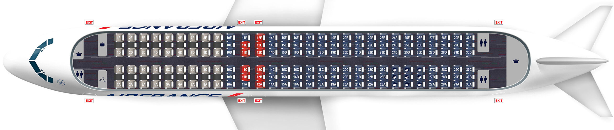
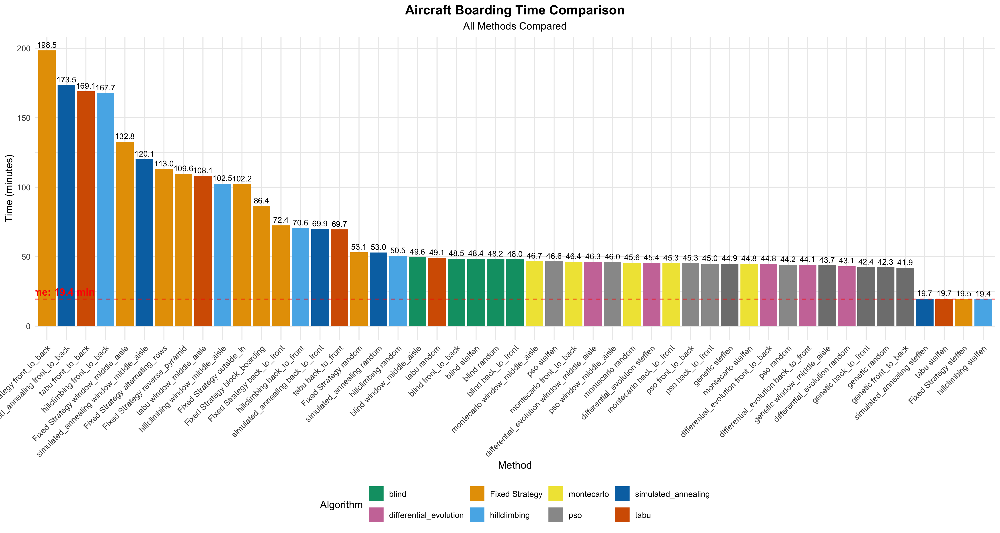

# ✈️ Optimization of Airplane Seating ✈️

This repository contains a comprehensive analysis and implementation of various algorithms to optimize airplane boarding strategies. The project compares traditional boarding methods with advanced optimization algorithms to reduce boarding times and improve passenger experience.

## 📂 Repository Structure

- **`AirplaneSeating.R`**: Main R script containing the implementation of various optimization algorithms.
- **`boarding_results.csv`**: Summary of the boarding time results for different strategies and algorithms.
- **`boarding_optimization_results.csv`**: Detailed output of the optimization runs.
- **`boarding_comparison.png`**: Visualization comparing boarding times across strategies.
- **`boarding_times_comparison.png`**: Chart highlighting the performance of optimization methods.

## 🚀 Getting Started

### Prerequisites

To run the code and reproduce the results, ensure you have the following installed:

- **R** (version 4.0 or newer)
- The following R libraries:
  - `dplyr`
  - `ggplot2`
  - `genalg`
  - `DEoptim`
  - `pso`
  - `tabuSearch`
  - `tidyr`
  - `scales`

You can install the required R packages with:

```R
install.packages(c("dplyr", "ggplot2", "genalg", "DEoptim", "pso", "tabuSearch", "tidyr", "scales"))
```

### Running the Code

1. Clone the repository:

   ```bash
   git clone https://github.com/DanteSc03/Optimization-of-Airplane-Seating.git
   ```

2. Open the R script `AirplaneSeating.R` in your preferred R IDE (e.g., RStudio).

3. Run the script to simulate and compare various boarding strategies and optimization algorithms.

### Output

- A CSV file summarizing the results (`boarding_results.csv`).
- Visualization plots (`boarding_comparison.png`, `boarding_times_comparison.png`) highlighting the performance of boarding methods.

## 🔍 Project Overview

The project addresses the following:

1. **Aircraft Configuration**:
   - A single-aisle aircraft with 30 rows and 6 seats per row (total: 180 passengers).
   - Passengers have varying luggage quantities, affecting boarding times.

2. **Optimization Algorithms**:
   - **Genetic Algorithms (GA)**
   - **Simulated Annealing (SA)**
   - **Differential Evolution (DE)**
   - **Particle Swarm Optimization (PSO)**
   - **Tabu Search**
   - **Hill Climbing**
   - **Blind Search**
   - **Monte Carlo Search**

3. **Objective**:
   - Minimize total boarding time.
   - Compare traditional boarding methods (e.g., front-to-back, random) with algorithm-optimized strategies.
  
4. **Seatmap**
  - This project was based on the seating configuration of an all economy class Airbus A320
  - This plane has 30 rows in a 3 x 3 configuration
  - This code can be adapted to all types of aircraft



## 📊 Key Results

### Fixed Strategies
The traditional boarding methods such as front-to-back and random boarding were evaluated. The results show significant variation in boarding times.

### Optimization Results
Optimization algorithms significantly outperformed traditional methods, with the best results achieved by methods like **Genetic Algorithms** and **Simulated Annealing**.



## 📈 Visualizations

### Boarding Time Comparison


## 🤝 Contributions

Contributions and suggestions are welcome! Feel free to fork this repository, open issues, or submit pull requests.

## 📄 License

This project is licensed under the MIT License - see the [LICENSE](LICENSE) file for details.

---

Authored by [Dante Schranz](https://github.com/DanteSc03).

--- 

Feel free to modify this README.md to better fit your project or add any additional details!
